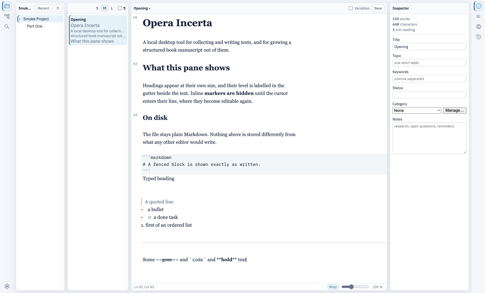

# Opera Incerta

**English** | [Deutsch](README.de.md)

Opera Incerta is a local desktop tool for collecting and writing texts, and for
growing a structured book manuscript out of them.

It is deliberately more than a Markdown editor: it accompanies the whole path
from a first collected thought to a finished manuscript. Your texts stay real
Markdown files on your own disk — one text is one file — and every display and
editing decision is measured against **overview** and **practical
operability**.

**Current release: `v0.1.0-beta.1` — public source beta.** This is working
software rather than an early scaffold: the library, the editor, the front
matter area, source control, search, navigation, and export are implemented
and exercised end to end by an automated gate that drives the real
application. Beta means that there are no signed installers yet, that native
packaging has not been run on Windows or Linux, and that some named parts of
the product — import, the assistant, snapshots — are specified but not built.
See the [project status](docs/en/project-status.md) for the precise maturity
and the remaining boundaries.

## The workbench



Four regions on one canvas: the project tree, the sheets of the selected
group, the editor, and a secondary sidebar with the inspector or the outline.
The screenshot is taken by the automated desktop check, from the real running
application.

## Who Opera Incerta is for

- Authors writing something long enough to need structure — a book, a thesis,
  a report — who want the structure visible without leaving the text.
- Writers who refuse to put their manuscript inside a proprietary container
  and want every file readable by any other editor, today and in ten years.
- Anyone who keeps a manuscript in Git and wants the tool to work with that
  rather than around it.

## Guiding ideas

These are normative rather than aspirational. Each one is enforced by the
specification and checked by the test gate.

- **The author's files belong to the author.** Texts are real Markdown files
  (`.md`, UTF-8) on the filesystem. One text is one file — a *sheet*. No
  database, no proprietary container. Any other Markdown application can read
  them without loss.
- **Metadata stays with its content.** Title, topic, keywords, status,
  category, and notes live as YAML front matter in the head of the same file,
  never in a sidecar. Moving a file in the Finder cannot orphan its metadata.
- **The folder structure *is* the library.** Groups are directories, sheets
  are files. What you see in the file manager is what the application shows.
- **Standard Markdown on disk, comfortable presentation in the editor.** A
  heading appears as a size, not as `#`; the file on disk stays
  standard-conformant.
- **Saving never discards anything.** Front matter written by other tools
  survives a load and save round trip byte for byte.
- **Renaming changes a title, never a file name.** The file keeps the identity
  it was created with, which is what keeps a manuscript's history readable.
- **Normal operation needs no network.** No account, no cloud, no service.
  The one stated exception is the AI assistant, which is not built yet and
  says so.

## Try the source beta

Use Node.js 24.15.0 or a newer 24.x release, and the pnpm version pinned in
`package.json`:

```shell
git clone https://github.com/indianerbande/opera-incerta.git
cd opera-incerta
corepack enable
corepack prepare pnpm@11.24.0 --activate
pnpm install --frozen-lockfile
pnpm run desktop:start
```

The application opens on its launcher. Create a project, or point it at a
folder of Markdown files you already have — it will offer to adopt the folder
as a project without moving or rewriting anything. The complete build and
verification instructions are in [Build from
source](docs/en/build-from-source.md).

## What Opera Incerta does

- Shows the manuscript as **project tree, sheet list, and editor**, with an
  inspector and an outline in a secondary sidebar.
- Edits Markdown with **formatting shown rather than spelled out**: headings
  at their own size with the level in the gutter, quotes, lists, task boxes,
  code, thematic breaks, and inline emphasis — with the marker revealed again
  on the line the cursor is in.
- Keeps **front matter out of the writing surface**, in an area of its own
  that is read-only until you say otherwise.
- Creates, renames, reorders by dragging, and deletes into the desktop trash —
  **without ever renaming a file**.
- Assigns **page categories** with colours, defined per project.
- Watches the project: a file changed behind the application's back reaches
  the editor, and a change made under unsaved work **asks before anything is
  lost**.
- Provides **source control** against the project's own Git repository:
  status, stage, unstage, commit, push, fetch, pull, merge with per-region
  conflict resolution, branches, amend, and `.gitignore` — with a prose diff
  that shows what changed word by word.
- **Finds** in the open sheet and searches the whole library.
- Remembers **where you have been**: back and forward through the sheets you
  opened, and the ten you saved most recently.
- **Exports** the manuscript as one Markdown file or as a PDF the application
  sets itself, whole or from one sheet on, with four supplied stylesheets or
  one you duplicated and changed.
- Speaks **English and German**, in the workbench and in the native menu.
- Offers **light and dark schemes** and eight accent palettes, with the
  typeface packaged rather than borrowed from the system.
- Is **reachable without a pointer**: every action has a menu item or a
  shortcut.

## How it is built

An Electron shell owns every filesystem, process, and Git access. The Angular
renderer runs sandboxed, with context isolation and without Node integration,
and receives **opaque handles** rather than paths it could act on. Between
them sits one versioned bridge whose every request is validated in the main
process — a compile-time type is not validation.

The rules that decide behaviour live in a portable core with no DOM, no
Electron, and no Node APIs, so they are tested without a window and produce
the same result wherever they run. The editor component sits behind a port
with its own contract suite, run against both the real component and an
in-memory double.

```text
Markdown files on disk
  -> project adapter (the only code that touches a filesystem)
  -> versioned bridge with runtime guards
  -> workbench regions
  -> editor display model
  -> the same standard Markdown, back on disk
```

## Vibe coding with engineering ownership

**Opera Incerta was vibe-coded — deliberately, transparently, and under
experienced human engineering direction.** Conversational AI accelerated
implementation, exploration, refactoring, tests, and documentation. It did not
own the architecture and did not lower the evidence required for a change.

This approach is useful only when the person directing it can design the
system, understand and reject generated code, judge the consequences for
security and maintenance, and recognise where an automated check is not
enough. The specification, the source, the test gates, and the evidence in
this repository remain authoritative. See [Vibe coding with engineering
ownership](docs/en/ai-assisted-development.md) for the benefits, the limits,
and the working rules behind that sentence.

## Verify the beta

After installing the dependencies, one command runs the complete source gate:

```shell
pnpm run check
```

It builds every package, type-checks the test code, runs every suite, verifies
the packaged desktop boundary, checks the hash-pinned assets, and validates
this documentation. Two further gates drive real software:

```shell
pnpm run desktop:smoke
pnpm run spike:editor
```

`desktop:smoke` launches the real shell and drives the real renderer with real
input events, reading its results from the disk and from Git rather than from
the application's own belief about them. What each gate proves is defined in
[testing](docs/engineering/testing.md).

## Current beta boundaries

What is implemented is implemented properly; what is missing is named rather
than implied.

- **No signed installers.** The beta is distributed as source. Native
  packaging has been prepared but **not yet run on any host** — see the
  [platform matrix](docs/en/platforms.md), which records that honestly rather
  than claiming coverage it does not have.
- **Import, the AI assistant, and snapshots are specified but not built.**
  The assistant will need a network connection by its nature, and will say so
  when there is none; nothing else in the application will acquire a network
  dependency.
- **DOCX and EPUB export** follow the Markdown and PDF that exist today.
- **Accessibility** is stated as a rule — every action reachable without a
  pointer — and checked as such. A formal WCAG conformance claim is
  deliberately not made, because it is only honest with tests behind it.

These and the smaller gaps are tracked in plain language in [the project
status](docs/en/project-status.md); the engineering work items are in the
[roadmap](docs/engineering/roadmap.md).

## Documentation

The [English documentation index](docs/en/README.md) is the best entry point.

- [User guide](docs/en/user-guide.md) — what the application does and how to
  work with it
- [Project status](docs/en/project-status.md) — what this beta means, and what
  it does not promise
- [Build from source](docs/en/build-from-source.md) — clone, verify, run, and
  package
- [Vibe coding with engineering ownership](docs/en/ai-assisted-development.md)
- [Native platform matrix](docs/en/platforms.md)
- [Release notes](docs/en/releases/0.1.0-beta.1.md)
- [CONTRIBUTING.md](CONTRIBUTING.md) — how to contribute
- [SECURITY.md](SECURITY.md) — private vulnerability reporting
- [Engineering documentation](docs/engineering/README.md) — specification,
  testing, conventions, dependencies, and roadmap

## Repository layout

| Path | Contents |
| --- | --- |
| `packages/core` | Portable domain rules. No DOM, no Electron, no Node.js APIs. |
| `packages/desktop-contract` | The versioned main-process/renderer bridge and its runtime guards. |
| `packages/export` | Export as a module: assembling the manuscript, the printable page, the stylesheets. |
| `packages/localization` | The English and German catalogues and the rules that read them. |
| `packages/markdown` | The block structure of a document, read with markdown-it and translated into the core's own types. |
| `packages/project-node` | Project and library adapter — owns filesystem access. |
| `packages/git-node` | Source-control adapter over the system `git`. |
| `apps/workbench` | Angular renderer: the workbench UI. |
| `apps/desktop` | Electron shell: lifecycle, windows, dialogs, packaging. |
| `examples/` | Original fixture projects. |
| `docs/` | Public documentation in English and German, and the engineering sources. |

## Originality

Opera Incerta is an original implementation. Ulysses, Scrivener, Obsidian,
Typora, iA Writer, and similar tools were studied only through public
documentation and observable behaviour; the three-column operating concept
takes Ulysses as a starting point and is expressly not a copy. No third-party
source code, grammar, documentation, fixture, or visual asset was copied into
this project.

## License

Opera Incerta is licensed under the [Apache License 2.0](LICENSE).
Third-party dependencies retain their own licenses and are documented in
[dependencies](docs/engineering/dependencies.md).
